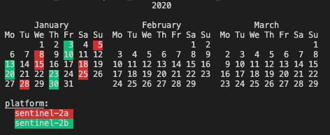

## Quickstart

pystac-client can be used as either a Command Line Interface (CLI) or a Python library.

### CLI

Use the CLI to quickly make searches and output or save the results.

The `--matched` switch performs a search with limit=1 so does not get any Items, but gets the total number of matches which will be output to the screen (if supported by the STAC API).

```
$ stac-client search https://earth-search.aws.element84.com/v0 -c sentinel-s2-l2a-cogs --bbox -72.5 40.5 -72 41 --matched
2179 items matched
```

If the same URL is to be used over and over, define an environment variable to be used in the CLI call:

```
$ export STAC_API_URL=https://earth-search.aws.element84.com/v0
$ stac-client search ${STAC_API_URL} -c sentinel-s2-l2a-cogs --bbox -72.5 40.5 -72 41 --datetime 2020-01-01/2020-01-31 --matched
48 items matched
```

Without the `--matched` switch, all items will be fetched, paginating if necessary. If the `--max-items` switch 
is provided it will stop paging once that many items has been retrieved. It then prints all items to stdout as an 
ItemCollection. This can be useful to pipe output to another process such as [stac-terminal](https://github.com/stac-utils/stac-terminal), [geojsonio-cli](https://github.com/mapbox/geojsonio-cli), or [jq](https://stedolan.github.io/jq/).

```
$ stac-client search ${STAC_API_URL} -c sentinel-s2-l2a-cogs --bbox -72.5 40.5 -72 41 --datetime 2020-01-01/2020-01-31 | stacterm cal --label platform
```



If the `--save` switch is provided instead, the results will not be output to stdout, but instead will be saved to
the specified file.

```
$ stac-client search ${STAC_API_URL} -c sentinel-s2-l2a-cogs --bbox -72.5 40.5 -72 41 --datetime 2020-01-01/2020-01-31 --save items.json
```

If the Catalog supports the
[Query extension](https://github.com/radiantearth/stac-api-spec/tree/master/fragments/query), 
any Item property can also be included in the search. Rather than requiring the JSON syntax 
the Query extension uses, pystac-client uses a simpler syntax that it will translate to the 
JSON equivalent. Note however that when the simple syntax is used it sends all property values
to the server as strings, except for `gsd` which it casts to `float`. This means that if there
are extensions in use with numeric properties these will be sent as strings. Some servers
may automatically cast this to the appropriate data type, others may not.

```
<property><operator><value>

where operator is one of `>=`, `<=`, `>`, `<`, `=`

Examples:
eo:cloud_cover<10
created=2021-01-06
view:sun_elevation<20
```

Any number of properties can be included, and each can be included more than once to use additional operators.

```
$ stac-client search ${STAC_API_URL} -c sentinel-s2-l2a-cogs --bbox -72.5 40.5 -72 41 --datetime 2020-01-01/2020-01-31 -q "eo:cloud_cover<10" --matched
10 items matched
```

```
stac-client search ${STAC_API_URL} -c sentinel-s2-l2a-cogs --bbox -72.5 40.5 -72 41 --datetime 2020-01-01/2020-01-31 -q "eo:cloud_cover<10" "eo:cloud_cover>5" --matched
```

### Python

To use the Python library, first a Client instance is created for a specific STAC API (use the root URL)

```
from pystac_client import Client

catalog = Client.open("https://earth-search.aws.element84.com/v0")
```

Create a search
```
mysearch = catalog.search(collections=['sentinel-s2-l2a-cogs'], bbox=[-72.5,40.5,-72,41], max_items=10)
print(f"{mysearch.matched()} items found")
```

The `get_items` function returns an iterator for looping through he returned items.

```
for item in mysearch.get_items():
    print(item.id)
```

To get all of Items from a search as a single
[PySTAC ItemCollection](https://pystac.readthedocs.io/en/latest/api.html#itemcollection)
use the `get_all_items` function. The `ItemCollection` can then be saved as a
GeoJSON FeatureCollection.

Save all found items as a single FeatureCollection

```
items = mysearch.get_all_items()
items.save('items.json')
```